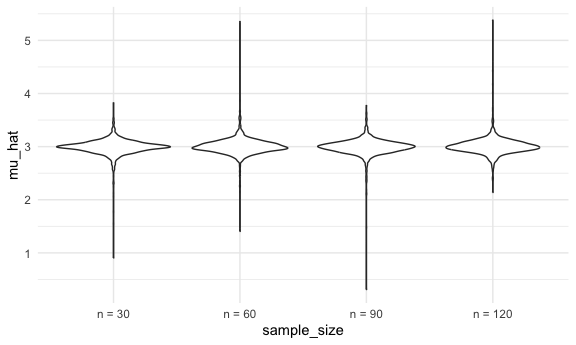
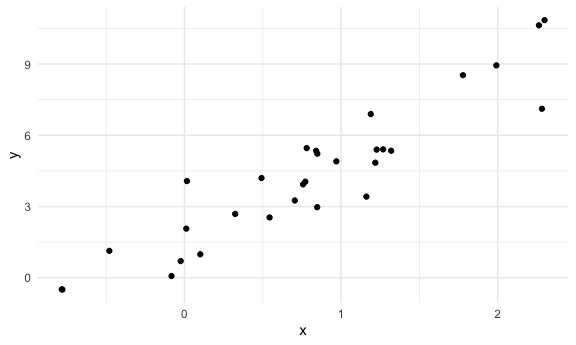
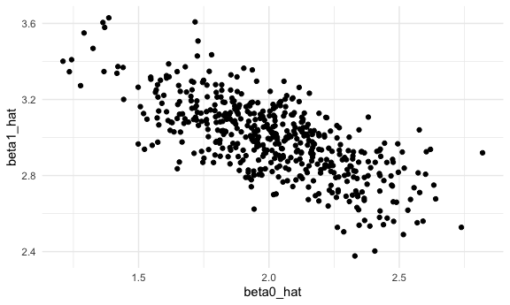
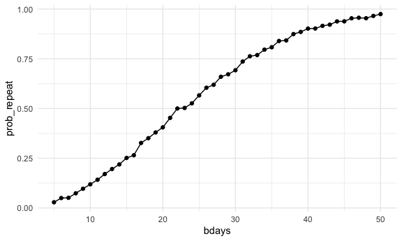

Simulation
================

Load key packages and source necessary files.

``` r
library(tidyverse)
source("source/sim_mean_sd.R")
```

We can “simulate” by running our function.

``` r
sim_mean_sd(n_subj = 400)
```

    ## # A tibble: 1 × 2
    ##   mu_hat sigma_hat
    ##    <dbl>     <dbl>
    ## 1   3.08      1.94

Can I “verify” the Central Limit Theorem?

First with a `for` loop

``` r
output = vector("list", length = 100)

for (i in 1:100) {
  
  output[[i]] = sim_mean_sd(30)
}

output |> 
  bind_rows() |> 
  ggplot(aes(x = mu_hat)) +
  geom_density()
```


Try to repeat with a `map` statement

``` r
sim_results_df =
  expand_grid(
    iter = 1:1000,
    sample_size = c(30, 60, 90, 120)
  ) |> 
  mutate(
    results = map(iter, sim_mean_sd)
  ) |> 
  unnest(results)
```

Let’s look at this:

Making a violin plot of sample size vs. mean

``` r
sim_results_df |> 
  mutate(
    sample_size = str_c("n = ", sample_size),
    sample_size = fct_inorder(sample_size)
  ) |> 
  ggplot(aes(x = sample_size, y = mu_hat)) +
  geom_violin()
```



Let’s try to summarize…

``` r
sim_results_df |> 
  group_by(sample_size) |> 
  summarize(
    emp_mean = mean(mu_hat),
    emp_se = sd(mu_hat)
  )
```

    ## # A tibble: 4 × 3
    ##   sample_size emp_mean emp_se
    ##         <dbl>    <dbl>  <dbl>
    ## 1          30     2.99  0.163
    ## 2          60     3.00  0.167
    ## 3          90     2.99  0.172
    ## 4         120     3.01  0.167

## Simple linear regression

``` r
sim_df =
  tibble(
    x = rnorm(30, mean = 1, sd = 1),
    y = 2 + 3 * x + rnorm(30, 0, 1)
  )

sim_df |> 
  ggplot(aes(x = x, y = y)) +
  geom_point()
```



``` r
slr_fit = lm(y ~ x, data = sim_df)

coef(slr_fit)
```

    ## (Intercept)           x 
    ##    1.715750    3.292254

Turn this into a function

``` r
sim_regression = function(n_subj, beta_0 = 2, beta_1 = 3) {
  
  sim_df =
  tibble(
    x = rnorm(n_subj, mean = 1, sd = 1),
    y = beta_0 + beta_1 * x + rnorm(n_subj, 0, 1)
  )
  
  slr_fit = lm(y ~ x, data = sim_df)
  
  tibble(
    beta0_hat = coef(slr_fit)[1],
    beta1_hat = coef(slr_fit)[2]
  )
}
```

``` r
sim_regression(n_subj = 30)
```

    ## # A tibble: 1 × 2
    ##   beta0_hat beta1_hat
    ##       <dbl>     <dbl>
    ## 1      1.73      2.97

Using `for` loops

``` r
output = vector("list", length = 500)

for (i in 1:500) {
  
  output[[i]] = sim_regression(n_subj = 30)
}

output |> 
  bind_rows()
```

    ## # A tibble: 500 × 2
    ##    beta0_hat beta1_hat
    ##        <dbl>     <dbl>
    ##  1      2.98      2.31
    ##  2      1.82      3.18
    ##  3      1.78      3.12
    ##  4      2.16      3.01
    ##  5      1.88      3.00
    ##  6      2.30      2.72
    ##  7      1.77      3.08
    ##  8      2.24      2.90
    ##  9      1.92      3.04
    ## 10      2.02      2.88
    ## # ℹ 490 more rows

Using`maps` instead.

``` r
slr_sim_results_df =
  expand_grid(
    sample_size = 30, 
    iter = 1:500
  ) |> 
  mutate(
    results = map(sample_size, sim_regression)
  ) |> 
  unnest(results)

slr_sim_results_df |> 
  ggplot(aes(x = beta0_hat, y = beta1_hat)) +
  geom_point()
```



## One more example !!

Jeff gave example of “birthday problem”

``` r
birthdays = sample(1:365, 5, replace = TRUE)
```

- `sample`: what are you sampling from, how many samples are you taking
- `replace = TRUE`: if you pick 17 first, you can also pick 17 later

Is there a repeated birthday?

``` r
unique(birthdays) < 5
```

    ## [1] FALSE FALSE FALSE FALSE FALSE

``` r
length(unique(birthdays)) < 5
```

    ## [1] FALSE

``` r
repeated_bday = length(unique(birthdays)) < 5

repeated_bday
```

    ## [1] FALSE

- `unique`: what are the unique values (e.g. birthdays) that show up in
  the vector
- `length`: if there’s repeat then it will be TRUE, if not, it’s FALSE

Put this in a function

``` r
bday_sim = function(n_room) {
  
  birthdays = sample(1:365, n_room, replace = TRUE)
  
  repeated_bday = length(unique(birthdays)) < n_room

  repeated_bday
  
}

bday_sim(20)
```

    ## [1] FALSE

``` r
bday_sim_results =
  expand_grid(
    bdays = 5:50,
    iter = 1:2500
  ) |> 
  mutate(
    result = map_lgl(bdays, bday_sim)
  ) |> 
  group_by(
    bdays
  ) |> 
  summarize(
    prob_repeat = mean(result)
  )
```

`map_lgl`: logic every single time (e.g. TRUE, FALSE)

Plot this

``` r
bday_sim_results |> 
  ggplot(aes(x = bdays, y = prob_repeat)) +
  geom_point() +
  geom_line()
```


